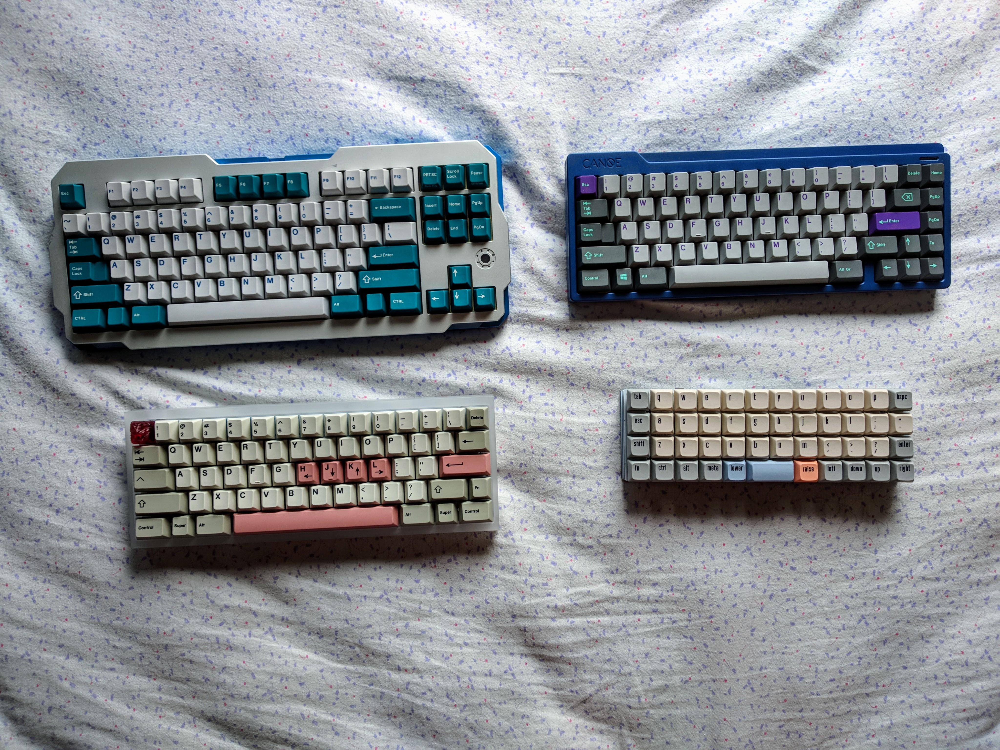

import gistia from "./themes/gistia";
import { Image } from "mdx-deck";
import { Split, FullScreenCode } from "@mdx-deck/layouts";
import { syntaxHighlighter } from "mdx-deck/themes";
import ImageBackground from "./components/image-background";
import AppearList from "./components/appear-list";
import Plot from "./components/plot";
import _ from "lodash";

export const themes = [syntaxHighlighter, gistia];

# tech talk #2

## functional programming in JS

### guilherme de andrade

---

# what is this talk about?

## SPOILER ALERT

---

<ImageBackground src="images/marie-kondo.jpg">
  about things that bring me joy!
</ImageBackground>

---

# got curious?

<AppearList items={["juice", "math", "döner kebab", "keyboards"]} />

---

# also...

<AppearList items={["functional programming", "JS"]} />

---

> “I've been hearing all the fuzz about _functional programming (fp)_ and all the cool kids have been talking about it lately. is this the _latest netflix's tv show_?”

---

# nope! _fp_ is as old as my _grandma_

---

<Split>


</Split>

---

> “do I need to throw away everything I've learned programming in [*insert a non-fp language*] if I want to dive into fp?”

---

no, you do not! however, since most of us are used to imperative programming, you would need to refactor your knowledge, so it could fit the fp way!

---

# fp's cornestones

<AppearList
  items={["pure functions", "first-class functions", "immutability"]}
/>

---

<ImageBackground src="images/nazare.jpg">pure functions</ImageBackground>

---

# yep, that's exactly what it's looking like: math time!

---

## in math, a function is nothing more than a relation between two sets, where one set is mapped to the other

---

## however, this mapping has to follow a simple rule:

### a given input will _always_ return the same output

---

<Split>

<Plot x={[1, 2, 3]} y={[2, 4, 6]} title="y = 2 * x" />

<Plot
  x={_.range(-3, 3, 0.1)}
  y={_.range(-3, 3, 0.1).map(x => x ** 2)}
  title="y = x ** 2"
/>

</Split>

---

<Plot
  x={_.range(-3, 3, 0.1).map(x => x ** 2)}
  y={_.range(-3, 3, 0.1)}
  title="x = y ** 2"
/>

## y = sqrt(x) || y = - sqrt(x)

---

<div style={{ display: 'flex' }}>

<div
   style={{
    fontSize: '14px',
    margin: '0.5rem',
    maxHeight: '900px',
    width: '800px',
    backgroundColor: '#F0F0F0'
   }}>

```jsx
const mechanicalKeyboardSwitches = [
  ["gateron yellow", "linjar", "greetech black", "gateron clear", "kbt red"], // linears
  ["outemu sky", "cherry mx brown", "halo true", "kailh pro purple"], // tactiles
  ["outemu blue"] // clickies
];

// impure
const minimum = 5;
const checkExperienceImpure = xs =>
  xs.map(switches => switches.length >= minimum);

// pure
const checkExperiencePure = xs => {
  const minimum = 5; // const immutableState = Object.freeze({ minimum: 5 })
  return xs.map(switches => switches.length >= minimum);
};

checkExperienceImpure(mechanicalKeyboardSwitches); // [ true, false, false ]
checkExperiencePure(mechanicalKeyboardSwitches); // [ true, false, false ]
```

</div>

<div
   style={{
    fontSize: '14px',
    margin: '0.5rem',
    height: '900px',
    width: '800px',
    backgroundColor: '#F0F0F0'
   }}>

```jsx
// impure
const addLinearSwitch = (xs, idx, str) => xs[idx].push(str);
addLinearSwitch(mechanicalKeyboardSwitches, 0, "mx cherry retooled black");
console.log(mechanicalKeyboardSwitches);
/*
[ [ 'gateron yellow',
    'linjar',
    'greetech black',
    'gateron clear',
    'kbt red',
    'mx cherry retooled black' ],
  [ 'outemu sky',
    'cherry mx brown',
    'halo true',
    'kailh pro purple' ],
  [ 'outemu blue' ] ]
*/

// pure
const addLinearSwitchPure = (xs, idx, str) => {
  const linearArr = xs[idx].concat([str]);
  const clone = xs.slice(0);
  clone[idx] = linearArr;
  return clone;
};

const res = addLinearSwitchPure(mechanicalKeyboardSwitches, 0, "gateron ink");
console.log(mechanicalKeyboardSwitches);
/*
[ [ 'gateron yellow',
    'linjar',
    'greetech black',
    'gateron clear',
    'kbt red',
    'mx cherry retooled black' ],
  [ 'outemu sky',
    'cherry mx brown',
    'halo true',
    'kailh pro purple' ],
  [ 'outemu blue' ] ]
*/

console.log(res);
/*
[ [ 'gateron yellow',
    'linjar',
    'greetech black',
    'gateron clear',
    'kbt red',
    'mx cherry retooled black',
    'gateron ink' ],
  [ 'outemu sky',
    'cherry mx brown',
    'halo true',
    'kailh pro purple' ],
  [ 'outemu blue' ] ]
*/
```

</div>

</div>

---

> “but I'm writing TS code, I don't need to bother! my functions are typed!”

---

<ImageBackground src="images/first-class.jpeg">
  first-class functions
</ImageBackground>

---


---


---



---


---

<ImageBackground src="images/big-mac.png">immutability</ImageBackground>

---

> “[...] the true constant is change. mutation hides change. hidden change creates chaos.”

_eric elliot_

---


---

what if my original object has OVER 9000 attributes?

---

<Image src="images/vegeta.jpg" />

---


---


---

thanks!
